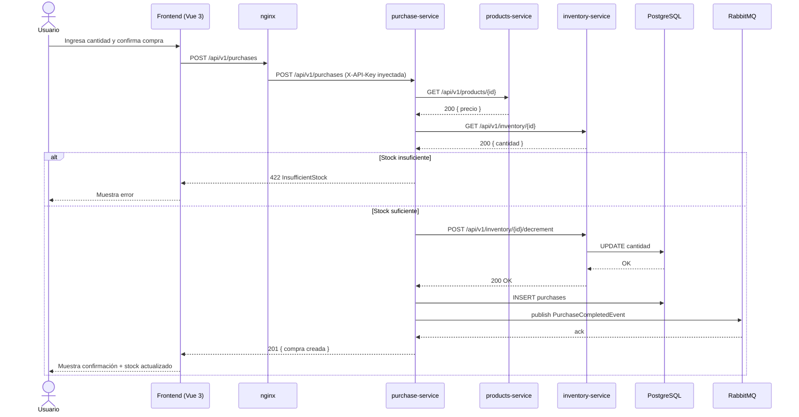

# Inventory Full-Stack

Sistema de gestión de inventario construido con microservicios Spring Boot 3, Vue 3 y orquestado con Docker Compose.

---

## Inicio Rápido

```bash
git clone https://github.com/aescorcia1993/inventory-fullStack.git
cd inventory-fullStack
docker compose up --build
```

| Interfaz | URL | Credenciales |
|---|---|---|
| **Frontend** | http://localhost:5173 | — |
| **RabbitMQ Management** | http://localhost:15672 | `rabbit_user` / `rabbit_pass` |
| **Swagger – products** | http://localhost:8081/swagger-ui.html | Header `X-API-Key: products-secret-key-2024` |
| **Swagger – inventory** | http://localhost:8082/swagger-ui.html | Header `X-API-Key: inventory-secret-key-2024` |
| **Swagger – purchase** | http://localhost:8083/swagger-ui.html | Header `X-API-Key: purchase-secret-key-2024` |
| **PostgreSQL** | `localhost:5432` | `inventory_user` / `inventory_pass` |

> Para detener y limpiar volúmenes: `docker compose down -v`

---

## Arquitectura Conceptual

```
┌─────────────────────────────────────────────────────────────────────┐
│                        inventory-net  (Docker Bridge)               │
│                                                                     │
│   ┌──────────────┐   X-API-Key   ┌──────────────────────────────┐   │
│   │   Frontend   │──────────────▶│        nginx (puerto 80)     │    
│   │  Vue 3+Vite  │               │  reverse proxy + envsubst    │   │
│   │  :5173→:80   │               └──────────────────────────────┘   │
│   └──────────────┘                    │          │          │       │
│                                       ▼          ▼          ▼       │
│              ┌─────────────────┐ ┌──────────┐ ┌──────────────────┐  │
│              │ products-service│ │inventory │ │ purchase-service │  │
│              │  Spring Boot 3  │ │-service  │ │  Spring Boot 3   │  │
│              │    :8081        │ │  :8082   │ │     :8083        │  │
│              └────────┬────────┘ └────┬─────┘ └────────┬─────────┘  │
│                       │               │                 │           │
│              ┌────────▼───────────────▼─────────────────▼────────┐  │
│              │              PostgreSQL 16  :5432                 │  │
│              │      products_db │ inventory_db │ purchases_db    │  │
│              └──────────────────────────────────────────────────-┘  │
│                                                                     │
│              ┌──────────────────────────────┐                       │
│              │      RabbitMQ 3.13 :5672      │◀─ purchase-service   
│              │   exchange: inventory.exchange│    publica eventos   │
│              └──────────────────────────────┘                       │
└─────────────────────────────────────────────────────────────────────┘
```

---

---

## Microservicios

### products-service · Puerto 8081

Responsable del catálogo de productos. Expone CRUD básico con respuestas JSON:API.

| Método | Ruta | Descripción |
|---|---|---|
| `GET` | `/api/v1/products` | Listar todos los productos |
| `GET` | `/api/v1/products/{id}` | Obtener producto por ID |
| `POST` | `/api/v1/products` | Crear producto |

**Ejemplo – Crear producto:**
```bash
curl -X POST http://localhost:8081/api/v1/products \
  -H "Content-Type: application/json" \
  -H "X-API-Key: products-secret-key-2024" \
  -d '{
    "data": {
      "type": "products",
      "attributes": { "nombre": "Laptop", "precio": 999.99, "descripcion": "Laptop 15 pulgadas" }
    }
  }'
```

---

### inventory-service · Puerto 8082

Gestiona el stock por producto. Permite consultar, actualizar y decrementar cantidades.

| Método | Ruta | Descripción |
|---|---|---|
| `GET` | `/api/v1/inventory/{productoId}` | Consultar stock de un producto |
| `POST` | `/api/v1/inventory` | Inicializar inventario para un producto |
| `PUT` | `/api/v1/inventory/{productoId}` | Establecer cantidad de stock |
| `POST` | `/api/v1/inventory/{productoId}/decrement` | Decrementar stock (uso interno) |

**Ejemplo – Consultar stock:**
```bash
curl http://localhost:8082/api/v1/inventory/{productoId} \
  -H "X-API-Key: inventory-secret-key-2024"
```

---

### purchase-service · Puerto 8083

Orquesta el flujo de compra: valida producto, verifica stock, registra la compra y publica un evento RabbitMQ.

| Método | Ruta | Descripción |
|---|---|---|
| `POST` | `/api/v1/purchases` | Realizar una compra |

**Ejemplo – Realizar compra:**
```bash
curl -X POST http://localhost:8083/api/v1/purchases \
  -H "Content-Type: application/json" \
  -H "X-API-Key: purchase-secret-key-2024" \
  -d '{
    "data": {
      "type": "purchases",
      "attributes": { "productoId": "UUID-DEL-PRODUCTO", "cantidad": 3 }
    }
  }'
```

**Errores posibles:**

| HTTP | Causa |
|---|---|
| `404` | Producto no existe en products-service |
| `422` | Stock insuficiente |
| `401` | API Key ausente o incorrecta |

---

## Flujo de Compra – Diagrama de Secuencia



---

## Estructura del Proyecto

```
inventory-fullStack/
├── BACKEND/
│   ├── products-service/       # Spring Boot 3.3 · Java 21 · Puerto 8081
│   │   └── src/
│   │       ├── domain/         # Modelos y puertos (sin framework)
│   │       ├── application/    # Casos de uso (@Service)
│   │       └── infrastructure/ # Web, JPA, Security
│   ├── inventory-service/      # Spring Boot 3.3 · Java 21 · Puerto 8082
│   └── purchase-service/       # Spring Boot 3.3 · Java 21 · Puerto 8083
│       └── infrastructure/
│           └── messaging/      # Publicación RabbitMQ (AMQP)
├── FRONTEND/
│   ├── src/
│   │   ├── features/
│   │   │   ├── products/       # Vistas, componentes y servicios de productos
│   │   │   └── inventory/      # Vistas, componentes y servicios de inventario
│   │   ├── stores/             # Pinia (products.ts, inventory.ts)
│   │   ├── plugins/            # Axios con deserializador JSON:API
│   │   └── assets/styles/      # SASS tokens, mixins, reset (BEM)
│   ├── nginx.conf              # Reverse proxy + inyección de API Keys
│   └── Dockerfile              # Build multi-etapa Node → nginx
├── scripts/
│   └── init-db.sql             # Crea products_db, inventory_db, purchases_db
└── docker-compose.yml
```

---

## Testing

### Ejecutar pruebas

```bash
# ── Backend ───────────────────────────────────────────────
cd BACKEND/products-service  && ./mvnw verify
cd BACKEND/inventory-service && ./mvnw verify
cd BACKEND/purchase-service  && ./mvnw verify

# ── Frontend ──────────────────────────────────────────────
cd FRONTEND
npm install
npm run test        # modo watch
npm run coverage    # reporte de cobertura
```

---

### Backend – Resumen de Pruebas

#### products-service

| Tipo | Clase | Casos cubiertos |
|---|---|---|
| Unitaria | `CreateProductUseCaseImplTest` | Creación exitosa · Nombre nulo → `IllegalArgumentException` · Precio negativo → excepción · Precio cero → excepción |
| Web (MockMvc) | `ProductControllerTest` | `POST` 201 con cuerpo JSON:API · Nombre ausente 422 · `GET /{id}` 200 · `GET /{id}` inexistente 404 · `GET /` lista todos |
| Integración | `ProductIntegrationTest` | Crear y recuperar producto (Testcontainers + PostgreSQL real) · Listado múltiple · ID inexistente 404 |

#### inventory-service

| Tipo | Clase | Casos cubiertos |
|---|---|---|
| Unitaria | `InventoryUseCaseImplTest` | Crear inventario OK · Cantidad negativa → excepción · Get no encontrado → `InventoryNotFoundException` · Update no encontrado · Decrement insuficiente → `InsufficientStockException` |
| Web (MockMvc) | `InventoryControllerTest` | GET stock · GET 404 · POST crea · PUT actualiza · POST decrement OK · POST decrement 422 |
| Integración | `InventoryIntegrationTest` | Ciclo completo crear → consultar → actualizar con PostgreSQL real |

#### purchase-service

| Tipo | Clase | Casos cubiertos |
|---|---|---|
| Unitaria | `CreatePurchaseUseCaseImplTest` | Compra exitosa guarda y publica evento · Producto no encontrado → no persiste · Stock insuficiente → no persiste ni publica · Cantidad cero rechazada por dominio |
| Web (MockMvc) | `PurchaseControllerTest` | POST compra 201 · Producto inexistente 404 · Stock insuficiente 422 |
| Integración | `PurchaseIntegrationTest` | Flujo completo con WireMock para products/inventory |

> Umbral de cobertura configurado con **JaCoCo ≥ 80%** de instrucciones. El build falla si no se alcanza.

---

### Frontend – Resumen de Pruebas

Framework: **Vitest + Vue Test Utils**. Cada test arranca con una instancia Pinia aislada.

| Archivo | Casos cubiertos |
|---|---|
| `ProductCard.spec.ts` | Renderiza nombre y precio formateado · Muestra descripción cuando existe · No la muestra cuando está ausente · Botón navega a `/inventory/{id}` |
| `ProductListView.spec.ts` | Estado de carga · Lista productos · Mensaje cuando no hay datos · Botón "Nuevo Producto" navega a `/products/new` |
| `InventoryView.spec.ts` | Estado "Cargando" inicial · Muestra stock y fecha al cargar · Muestra error cuando falla el fetch |

---

## Decisiones Técnicas

### ¿Por qué purchase-service es un servicio independiente?
La lógica de compra coordina dos dominios (catálogo y stock) y publica eventos asíncronos. Separarla evita acoplar products e inventory, permite escalarla de forma independiente y sigue el principio de responsabilidad única.

### Arquitectura Hexagonal
Cada servicio tiene tres capas: `domain/` (modelos y puertos, sin framework), `application/` (casos de uso con `@Service`) e `infrastructure/` (persistencia, web, mensajería). Permite testear la lógica de negocio sin levantar Spring.

### PostgreSQL sobre SQLite
SQLite no soporta conexiones concurrentes de múltiples contenedores. PostgreSQL 16 Alpine es ligero, soporta UUID nativo y es el estándar en producción.

### RestClient en lugar de Feign
Spring Boot 3.2 incluye `RestClient` como API fluida moderna. Feign requiere Spring Cloud, innecesario para tres servicios sin service-discovery.

### JSON:API
Estructura clara con `type`, `id` y `attributes`. Permite evolución del API sin romper clientes y unifica el manejo de errores con `errors[]`.

### API Key por `OncePerRequestFilter`
Validación del header `X-API-Key` antes de que llegue al controlador. Las API Keys se inyectan en nginx en tiempo de arranque del contenedor (via `envsubst`) y nunca viajan en el bundle JS.

### nginx como gateway del frontend
Centraliza la inyección de API Keys, evita CORS y resuelve nombres DNS de Docker en tiempo de petición con `resolver 127.0.0.11` y variable `$upstream`.

---

## Variables de Entorno

| Variable | Servicio | Valor por defecto |
|---|---|---|
| `APP_API_KEY` | products-service | `products-secret-key-2024` |
| `APP_API_KEY` | inventory-service | `inventory-secret-key-2024` |
| `APP_API_KEY` | purchase-service | `purchase-secret-key-2024` |
| `PRODUCTS_API_KEY` | frontend/nginx | `products-secret-key-2024` |
| `INVENTORY_API_KEY` | frontend/nginx | `inventory-secret-key-2024` |
| `PURCHASE_API_KEY` | frontend/nginx | `purchase-secret-key-2024` |
| `POSTGRES_USER` | postgres | `inventory_user` |
| `POSTGRES_PASSWORD` | postgres | `inventory_pass` |
| `RABBITMQ_DEFAULT_USER` | rabbitmq | `rabbit_user` |
| `RABBITMQ_DEFAULT_PASS` | rabbitmq | `rabbit_pass` |

---

## Uso de Herramientas de IA

Este proyecto fue desarrollado con asistencia de **GitHub Copilot** (modelo **Claude Sonnet 4.6**) como agente de codificación en VS Code.

### Qué generó el agente

| Área | Tareas |
|---|---|
| **Backend** | Estructura Maven multi-módulo, arquitectura hexagonal, entidades JPA, migraciones Flyway, controladores JSON:API, filtros de seguridad, cliente `RestClient`, publicación AMQP, manejo de excepciones global |
| **Frontend** | Configuración Vite + Vue 3 + TypeScript, stores Pinia, servicios Axios con deserializador JSON:API, componentes SASS/BEM, validación VeeValidate + Zod, rutas lazy-load |
| **Infraestructura** | `docker-compose.yml` con health checks y `depends_on`, Dockerfiles multi-etapa, `nginx.conf` con envsubst y resolver Docker DNS, `init-db.sql` |
| **Testing** | Tests unitarios con Mockito, `@WebMvcTest` con MockMvc, pruebas de integración con Testcontainers, specs Vitest + Vue Test Utils |
| **Depuración** | Diagnóstico iterativo de errores de build y runtime: CRLF en scripts shell, `pg_isready` sin base de datos, nginx DNS pre-resolución, API Key bloqueando `/actuator/health`, inventario no inicializado al crear producto |

### Cómo se verificó la calidad
- Todo el código generado fue revisado para verificar adherencia a los requisitos del dominio.
- Los tests se ejecutaron en contenedor para confirmar comportamiento real, no solo local.
- Se inspeccionaron logs de Docker (`docker logs`, `docker inspect`) para cada error de runtime antes de aplicar correcciones.
- El agente fue guiado con contexto explícito del error en cada iteración, no con instrucciones genéricas.

