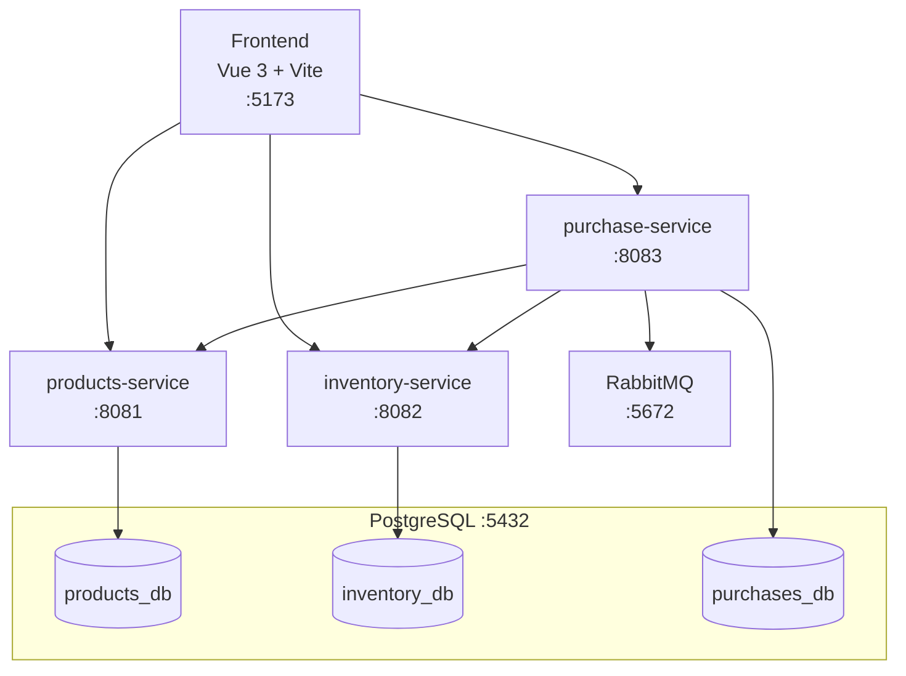
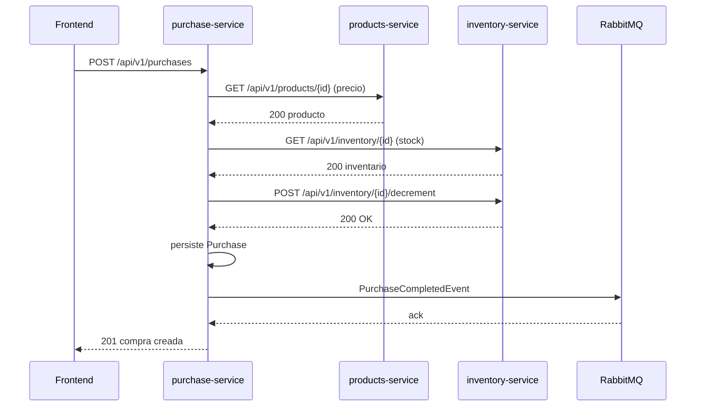

# Inventory Full-Stack

Sistema de gestión de inventario basado en microservicios con Spring Boot 3 y Vue 3.

## Arquitectura



### Servicios

| Servicio | Puerto | Base de datos | Responsabilidad |
|---|---|---|---|
| `products-service` | 8081 | `products_db` | CRUD de productos |
| `inventory-service` | 8082 | `inventory_db` | Gestión de stock |
| `purchase-service` | 8083 | `purchases_db` | Procesamiento de compras |
| `frontend` | 5173 | — | Interfaz web Vue 3 |

## Flujo de Compra



## Decisiones Técnicas

### Por qué purchase-service es independiente
La lógica de compra coordina dos dominios (productos e inventario) y publica eventos asíncronos. Separarla evita acoplar los dominios de catálogo y stock, permite escalar el servicio de compras de forma independiente y mantiene las responsabilidades claras.

### RestClient vs Feign
Spring Boot 3.2 introduce `RestClient` como API fluida y moderna sin requerir Spring Cloud. Feign añadiría una dependencia de Spring Cloud innecesaria para tres servicios sin discovery. `RestClient` ofrece la misma ergonomía con menos dependencias.

### Arquitectura Hexagonal
Cada servicio tiene tres capas: `domain/` (modelos y puertos, sin framework), `application/` (casos de uso con `@Service`) e `infrastructure/` (persistencia, web, mensajería). Esto permite testear la lógica de negocio sin levantar Spring.

### JSON:API
Formato estándar que estructura claramente tipo, id y atributos. Facilita la evolución del API y el manejo uniforme de errores con `errors[]`.

### Autenticación por API Key
Cada servicio valida el header `X-API-Key` mediante un `OncePerRequestFilter`. Es adecuado para comunicación intra-servicio en red privada (Docker).

## Requisitos

- Docker 24+
- Docker Compose 2.24+

## Instalación y Ejecución

```bash
# Clonar el repositorio
git clone <repo-url>
cd inventory-fullStack

# Levantar todos los servicios
docker compose up --build

# Acceder a la aplicación
# Frontend:  http://localhost:5173
# RabbitMQ:  http://localhost:15672  (rabbit_user / rabbit_pass)
```

## Variables de Entorno

| Variable | Descripción | Valor por defecto |
|---|---|---|
| `PRODUCTS_API_KEY` | API key para products-service | `products-secret-key-2024` |
| `INVENTORY_API_KEY` | API key para inventory-service | `inventory-secret-key-2024` |
| `PURCHASE_API_KEY` | API key para purchase-service | `purchase-secret-key-2024` |
| `VITE_PRODUCTS_API_KEY` | API key frontend → products | — |
| `VITE_INVENTORY_API_KEY` | API key frontend → inventory | — |
| `VITE_PURCHASE_API_KEY` | API key frontend → purchases | — |

## API Endpoints

### products-service (`:8081`)

| Método | Ruta | Descripción |
|---|---|---|
| `GET` | `/api/v1/products` | Listar todos los productos |
| `GET` | `/api/v1/products/{id}` | Obtener producto por ID |
| `POST` | `/api/v1/products` | Crear producto |

### inventory-service (`:8082`)

| Método | Ruta | Descripción |
|---|---|---|
| `GET` | `/api/v1/inventory/{productoId}` | Obtener inventario por producto |
| `POST` | `/api/v1/inventory` | Crear entrada de inventario |
| `PUT` | `/api/v1/inventory/{productoId}` | Actualizar stock |
| `POST` | `/api/v1/inventory/{productoId}/decrement` | Decrementar stock |

### purchase-service (`:8083`)

| Método | Ruta | Descripción |
|---|---|---|
| `POST` | `/api/v1/purchases` | Realizar compra |

Todos los endpoints requieren el header `X-API-Key` con la clave correspondiente al servicio.

## Documentación OpenAPI

Swagger UI disponible en cada servicio:
- Products: http://localhost:8081/swagger-ui.html
- Inventory: http://localhost:8082/swagger-ui.html
- Purchase:  http://localhost:8083/swagger-ui.html

## Tests

```bash
# Backend — ejecutar desde cada servicio
cd BACKEND/products-service && ./mvnw verify
cd BACKEND/inventory-service && ./mvnw verify
cd BACKEND/purchase-service  && ./mvnw verify

# Frontend
cd FRONTEND
npm install
npm run test
npm run coverage
```

## Cobertura de Tests

Los tres servicios backend están configurados con JaCoCo (`jacoco-maven-plugin:0.8.11`) con umbral mínimo del 80% de cobertura de instrucciones. El build falla si no se alcanza el umbral.

Los tests de frontend usan Vitest + Vue Test Utils cubriendo renderizado de componentes, interacciones de usuario y estados de carga/error.

## Uso de Herramientas de IA

Este proyecto fue desarrollado con asistencia de GitHub Copilot (modelo Claude Sonnet 4.6) como agente de codificación en VS Code. El asistente generó:

- Estructura de proyectos Maven/Spring Boot para los tres microservicios con arquitectura hexagonal
- Configuración de Docker Compose y scripts de inicialización de base de datos
- Migraciones Flyway, entidades JPA y adaptadores de repositorio
- Filtros de seguridad, controladores REST con JSON:API y manejadores de excepciones
- Clases de prueba unitaria e integración (Testcontainers, Mockito, WebMvcTest)
- Tienda Pinia, composables Vue 3 y componentes con SASS/BEM
- Esta documentación

Todo el código generado fue revisado para verificar corrección funcional, adherencia a los requisitos del dominio y ausencia de vulnerabilidades OWASP Top 10.
